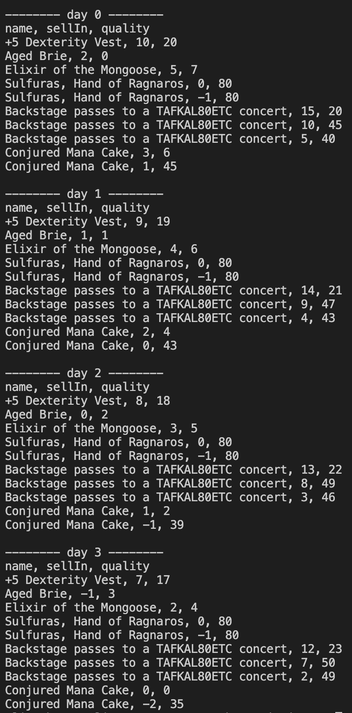

# Gilded Rose

This is the Gilded Rose kata in JavaScript with Jest

## Getting started

Install dependencies

```sh
npm install
```

## Running tests

To run all tests

```sh
npm test
```

To run all tests in watch mode

```sh
npm run test:watch
```

To generate test coverage report

```sh
npm run test:coverage
```

To run text test

```sh
node test/texttest_fixture.js
```
(default is two days)  

To run text test for custom number of days (e.g. 25)

```sh
node test/texttest_fixture.js 25
```

To run eslint 

```sh
npx eslint .
```

# Challenge Guidelines

This is a well known kata developed by [Terry Hughes](http://iamnotmyself.com/2011/02/13/refactor-this-the-gilded-rose-kata/). This is commonly used as a tech test to assess a candidate's ability to read, refactor and extend legacy code.

Here is the text of the kata:

*"Hi and welcome to team Gilded Rose. As you know, we are a small inn with a prime location in a prominent city run by a friendly innkeeper named Allison. We also buy and sell only the finest goods. Unfortunately, our goods are constantly degrading in quality as they approach their sell by date. We have a system in place that updates our inventory for us. It was developed by a no-nonsense type named Leeroy, who has moved on to new adventures. Your task is to add the new feature to our system so that we can begin selling a new category of items. First an introduction to our system:

All items have a `SellIn` value which denotes the number of days we have to sell the item. All items have a Quality value which denotes how valuable the item is. At the end of each day our system lowers both values for every item. Pretty simple, right? Well this is where it gets interesting:

- Once the sell by date has passed, Quality degrades twice as fast
- The Quality of an item is never negative
- “Aged Brie” actually increases in Quality the older it gets
- The Quality of an item is never more than 50
- “Sulfuras”, being a legendary item, never has to be sold or decreases in Quality
- “Backstage passes”, like aged brie, increases in Quality as it’s `SellIn` value approaches; Quality increases by 2 when there are 10 days or less and by 3 when there are 5 days or less but Quality drops to 0 after the concert

We have recently signed a supplier of conjured items. This requires an update to our system:

* “Conjured” items degrade in Quality twice as fast as normal items

Feel free to make any changes to the `UpdateQuality` method and add any new code as long as everything still works correctly. However, do not alter the Item class or Items property as those belong to the goblin in the corner who will insta-rage and one-shot you as he doesn’t believe in shared code ownership (you can make the `UpdateQuality` method and Items property static if you like, we’ll cover for you)."*

# Plan 

1. Write comprehensive testing for current functionality. Ensure all tests pass. Aim for 100% coverage.
2. Refactor. The legacy code is not very DRY and has large complex if statements that code be shortened/simplified. Extract classes where appropriate (different types of item)
3. Add "Conjured" class via TDD. 

Classes:
Item  
- Regular item
- Aged brie
- Sulfuras
- Backstage pass
- Conjured

# Approach

##### My approach to designing this solution was as follows:  
1. Planning 
  - I made myself familiar with the legacy code to understand what functionlity was already in place
  - I did the above planning to calculate in advance what sort of classes I would need to extract.
2. TDD and OOP 
  - I started by writing feature tests for how I wished to proceed with class extraction. I let the feature tests then inform my unit tests for each class I made. I worked my way through each class using TDD in this way; passing all tests and refactoring.
  - I used OOP to refactor the code to be much clearer and more legible
  - Once all legacy code was passing all tests and test coverage was 100%, I moved on to TDD the solution for conjured items.

# Structure 
##### I structured my code as follows:
As per my planning, I added five classes:   
1. RegularItem
2. AgedBrie
3. Sulfuras
4. BackstagePass
5. ConjuredItem 

Each of these classes inherited their attributes from the pre-existing Item class. I created these classes in order to follow the SRP. Each type of item's quality updated in a different way. Therefore it made sense to create many different classes, each with a method named "updateQuality", as opposed to having a long and complex 'if' statement in the Shop class.  
I removed all conditionals from the Shop class and replaced it with a method named "updateItemQuality". This iterates over the 'items' array and calls 'updateQuality' on each item.

# Dependencies 
 - jest
  - for testing and test coverage  
 - eslint 
  - to linter

# Solution 

The following screenshot demonstrates the deprecation/improvement of each type of item over 4 days.  
It is run by the command: 

```sh
node test/texttest_fixture.js 4
```




  